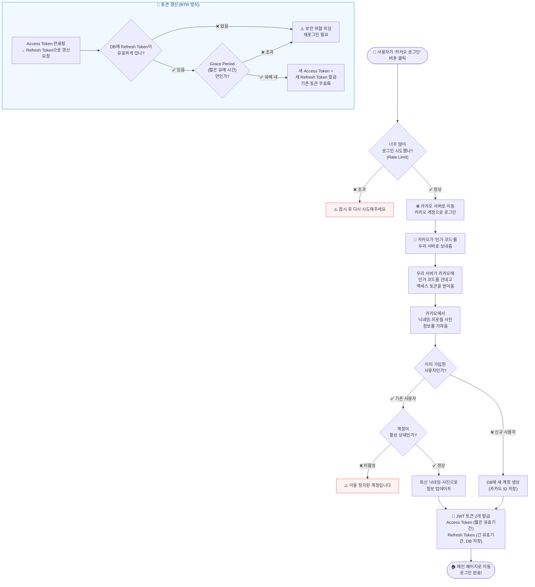
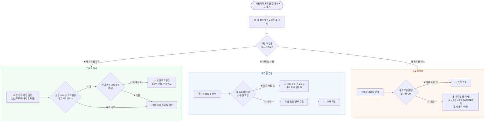
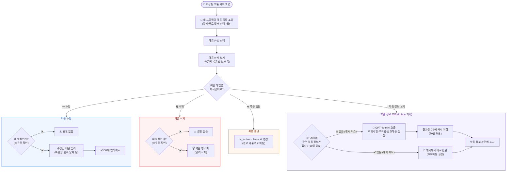
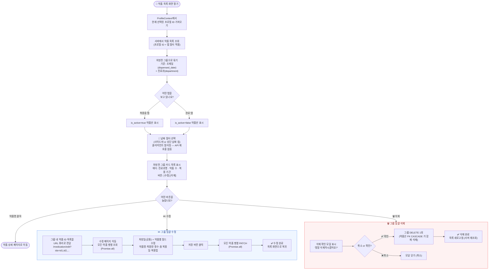
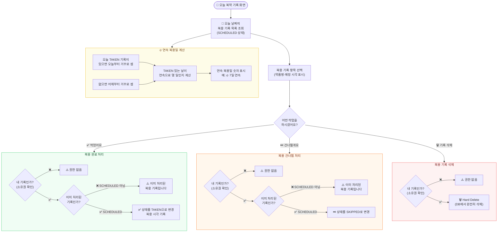
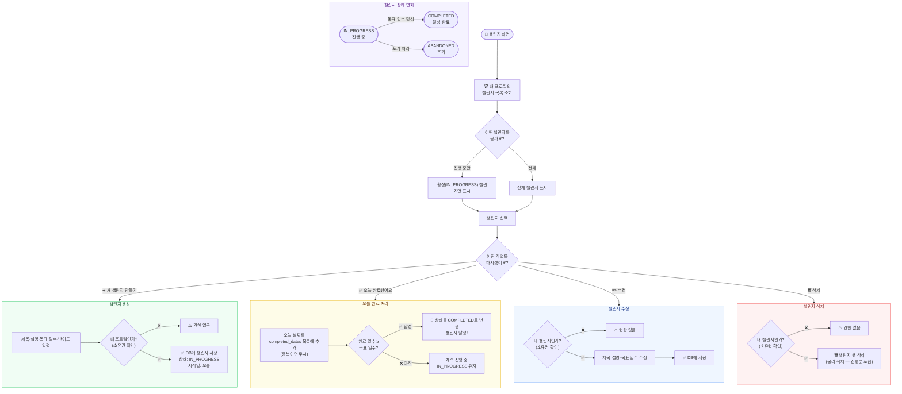

# 기능별 흐름도 (AS-IS / TO-BE)

> **AS-IS**: 현재 코드가 동작하는 방식
> **TO-BE**: 수정·개선 후 동작 방식 (수정 완료 시 업데이트)

---

## 목차
1. [로그인 (OAuth)](#1-로그인-oauth)
2. [프로필 관리](#2-프로필-관리)
3. [처방전(약품) 수정·삭제](#3-처방전약품-수정삭제)
4. [복약 기록](#4-복약-기록)
5. [챌린지](#5-챌린지)

---

## 1. 로그인 (OAuth)

### AS-IS

### TO-BE

> 수정 후 이 칸을 채워주세요.

---

## 2. 프로필 관리

### AS-IS

### TO-BE

> 수정 후 이 칸을 채워주세요.

---

## 3. 처방전(약품) 수정·삭제

### AS-IS

### TO-BE

> **변경 핵심**: 개별 약품 단위 → **처방전 그룹 단위** 일괄 수정·삭제로 변경

**AS-IS vs TO-BE 핵심 차이**

| 항목 | AS-IS | TO-BE |
|------|-------|-------|
| 수정·삭제 단위 | 개별 약품 1개 | 처방전 그룹 전체 |
| 수정 진입 방법 | 약품 상세 → 수정 버튼 | 목록 그룹 헤더 → 수정 버튼 |
| 처방일 수정 | 약품마다 개별 입력 | 처방일 1개 → 그룹 전체 공통 적용 |
| 삭제 방식 | 상세 페이지에서 단건 삭제 | 목록에서 확인 모달 → 그룹 일괄 삭제 |
| API 호출 방식 | 단건 PATCH / DELETE | Promise.all 병렬 요청 |
| 날짜 필터 | 없음 | 사이드바 + 날짜 칩 (클라이언트 필터) |

---

## 4. 복약 기록

### AS-IS

### TO-BE

> 수정 완료 후 이 칸을 채워주세요.

---

## 5. 챌린지

### AS-IS

### TO-BE

> 수정 완료 후 이 칸을 채워주세요.

---

## 변경 이력

| 날짜 | 기능 | 변경 내용 |
|------|------|----------|
| - | - | AS-IS 최초 작성 |
