> 📌 **2026-09-21 공개 `docs/` 로 승격** (트랙 B-9 정독·분류). 작성 **2026-05-05**.
> 단계별 코드 위치 표 20행을 전수 실측해 **전부 실재함을 확인**하고 옮겼다.
>
> ✏️ **옮기면서 고친 것 2곳** (원문은 틀렸다):
> - 엔드포인트 — `POST /sessions/{id}/messages` → **`POST /api/v1/messages/ask`**
>   (`message_routers.py:84` 가 `ask_with_tools` 를 부르고, FE `ChatModal.jsx:405` 도 이 경로를 쓴다)
> - 8-a — *"pgvector **HNSW** search … + `ef_search`"* → **인덱스가 없다.**
>   `medicine_chunk.embedding` 은 `halfvec(3072)` 인데 **HNSW 인덱스가 배포돼 있지 않고**,
>   코드에 `ef_search` 도 0건이다. 즉 벡터 검색은 **전체 스캔**이다
>   (`docs-private/DOC_TRUTH_DRIFT.md` §76~111 · **QA-04**/**QA-17** 과 한 묶음).
>
> 🔴 **`docs/chatbot_flow.md` 와 둘이 서로 다른 아키텍처를 서술한다.** 그쪽은 *"Router LLM 이
> tool 선택으로 의도 분류"* 인데 **그 설계는 폐기됐다**(`router_llm` 0건). 이 문서가 현행이다.
> 두 벌을 한 벌로 합치는 일은 **문서-22** 로 등재했다.

---

# 챗봇 풀 흐름 — "타이레놀 먹어도 괜찮아?" 케이스

작성일: 2026-05-05
대상: domain_question 분기 (RAG 4단 retrieval + 4o 답변 생성)

본 문서는 사용자가 챗봇 모달에서 "타이레놀 먹어도 괜찮아?" 를 입력했을 때
요청이 어떤 단계를 거쳐 답변까지 도달하는지 한 단계도 빼지 않고 추적한다.

```mermaid
flowchart TD
    U["사용자 입력<br/>타이레놀 먹어도 괜찮아?"] --> HTTP["POST /api/v1/messages/ask<br/>JWT 쿠키 attach"]
    HTTP --> MW["SecurityMiddleware<br/>get_current_account 으로 JWT 검증<br/>Account 객체 주입"]
    MW --> ROUTER["message_routers.ask 핸들러<br/>요청 body content 추출"]
    ROUTER --> AWT["MessageService.ask_with_tools<br/>session_id, account_id, content"]

    AWT --> S1["1 ownership 검증<br/>_verify_session_ownership<br/>chat_session.account_id == account_id"]
    S1 --> S2["2 최근 6개 메시지 fetch<br/>get_recent_by_session limit=6<br/>3 user + 3 assistant 페어"]
    S2 --> S3["3 session_summary fetch<br/>_fetch_session_summary<br/>옵션 D 누적 요약 텍스트"]
    S3 --> S4["4 session 객체 조회<br/>session_repository.get_by_id<br/>profile_id 추출, 없으면 404"]
    S4 --> S5["5 user_msg DB persist<br/>create_user_message<br/>실패 시 이후 단계에서 soft-delete rollback"]

    S5 --> CT["6 classify_user_turn<br/>intent_orchestrator"]
    CT --> MC["6-a medical_context 조립<br/>active medications<br/>+ Profile.health_survey<br/>나이/성별/기저질환/알레르기/흡연·음주"]
    MC --> IM["6-b 용어 매핑 빌드<br/>brand to 활성성분<br/>예 타이레놀 to 아세트아미노펜"]
    IM --> QR["6-c Query Rewriter LLM 호출<br/>gpt-4o-mini<br/>response_format=QueryRewriterOutput<br/>system = SYSTEM_PROMPT + medical_context"]
    QR --> QRO["QueryRewriterOutput 반환<br/>intent=domain_question<br/>rewritten_query: 간 질환 환자가 와파린 복용 중 아세트아미노펜 병용 시 주의사항 등 user 컨텍스트 prepend<br/>target_drugs: 타이레놀<br/>target_ingredients: 아세트아미노펜<br/>target_conditions: user 보유 controlled vocab<br/>target_sections: drug_interaction, adverse_reaction, special_event<br/>interaction_concerns: user 복용약 활성성분 set"]

    QRO --> BR{"intent 분기 4가지"}
    BR -->|"direct_answer<br/>greeting / out_of_scope / ambiguous"| BR1["즉시 direct_answer persist<br/>_persist_direct_answer_turn 종료"]
    BR -->|"location_search"| BR2["_handle_location_search<br/>카카오 Local API + 4o<br/>또는 GPS pending turn TTL=60s"]
    BR -->|"recall_check"| BR3["_handle_recall_check<br/>check_user_medications_recall<br/>또는 check_manufacturer_recalls<br/>ai-worker 툴 호출 + 4o 자연어"]
    BR -->|"domain_question (본 케이스)"| FT["_finalize_rag_turn"]

    FT --> EMB["7 encode_query<br/>OpenAI text-embedding-3-large<br/>입력 = rewritten_query<br/>출력 = halfvec 3072차원 단일 벡터"]
    EMB --> RET["8 retrieve_with_metadata<br/>hybrid metadata retrieval"]
    RET --> R1["8-a pgvector 유사도 검색<br/>medicine_chunk 테이블<br/>halfvec 코사인 거리<br/>인덱스 없음 = 전체 스캔<br/>candidate 100건 정도"]
    R1 --> R2["8-b jsonb metadata 필터<br/>jsonb_path_ops GIN 인덱스<br/>target_ingredients in chunk.ingredients<br/>target_sections in chunk.section<br/>target_conditions in chunk.conditions"]
    R2 --> R3["8-c RRF 가중 결합 + dedupe<br/>벡터 distance + metadata 매칭 점수<br/>top K 청크 선택<br/>medicine_id 단위 dedupe<br/>chunk preview 로그 출력 medicine#section@distance"]
    R3 --> AS["9 assemble_rag_section<br/>chunks to 마크다운 컨텍스트<br/>형식 약: 타이레놀 / 성분: 아세트아미노펜 / drug_interaction<br/>본문 + 식약처 출처 footer 자연어"]

    AS --> CP["10 _compose_system_prompt<br/>parts 순서대로 합성<br/>_PERSONA_AND_RULES persona + 안전 룰 + 자체검증<br/>+ session_summary 누적 요약<br/>+ referent_resolution (본 케이스 비어 있음)<br/>+ medical_context 사용자 의학정보<br/>+ ingredient_mapping_section brand-성분<br/>+ rag_section 검색 chunk"]

    CP --> RQE["11 generate_chat_response_via_rq<br/>messages = system + history 6 + user 1<br/>RQ ai 큐에 enqueue"]
    RQE --> AW["12 ai-worker job 픽업<br/>generate_chat_response_task"]
    AW --> LLM["13 OpenAI gpt-4o 호출<br/>system 합성 prompt<br/>messages history + user"]
    LLM --> ANS["14 answer 문자열 반환<br/>persona 톤 + 사용자 의학 컨텍스트 인지 표시<br/>+ chunk 인용 + 출처 footer<br/>+ 임신/수유 가드 (비교적 안전 등 금지 표현 차단)"]

    ANS --> AP["15 assistant_msg DB persist<br/>create_assistant_message"]
    AP --> CC["16 count_by_session<br/>그 세션의 총 메시지 수"]
    CC --> CDEC{"17 compact 조건 판정<br/>total >= 6 AND<br/>total % 6 == 0?"}
    CDEC -->|"YES"| CENQ["17-a session_compact RQ 큐 enqueue<br/>compact_and_save_session_job<br/>ai-worker background 처리<br/>chat_sessions.summary 갱신<br/>응답 latency 영향 X"]
    CDEC -->|"NO"| RET2["skip compact"]
    CENQ --> ARR["18 AskResult 반환"]
    RET2 --> ARR
    ARR --> JR["19 router to JSON response<br/>user_message + assistant_message + pending=null"]
    JR --> FE["20 FE 챗봇 모달 렌더<br/>유저 말풍선 + 어시스턴트 답변"]
    FE --> END["사용자 화면에 답변 표시"]
```



## 단계별 코드 위치 빠른 참조

| 단계 | 파일 | 주요 함수 / 상수 |
|---|---|---|
| 1 ownership | `app/services/message_service.py` | `_verify_session_ownership` |
| 2 history | `app/repositories/message_repository.py` | `get_recent_by_session` (limit=6 = `_HISTORY_LIMIT`) |
| 3 summary | `app/services/message_service.py` | `_fetch_session_summary` |
| 4 session | `app/repositories/chat_session_repository.py` | `get_by_id` |
| 5 user msg persist | `app/repositories/message_repository.py` | `create_user_message` |
| 6 classify | `app/services/chat/intent_orchestrator.py` | `classify_user_turn` |
| 6-a medical_ctx | `app/services/chat/medical_context.py` | `assemble_medical_context_for_chat` |
| 6-b 용어 매핑 | `app/services/chat/medical_context.py` | brand→ingredient 변환 (active medications + medicine_info join) |
| 6-c Query Rewriter | `app/services/intent/query_rewriter.py` | `rewrite_query`, `_MODEL = gpt-4o-mini` |
| 7 encode_query | `app/services/rag/openai_embedding.py` | `encode_query` (text-embedding-3-large, halfvec[3072]) |
| 8 retrieve | `app/services/rag/retrievers/hybrid_metadata.py` | `retrieve_with_metadata` (HNSW + jsonb 필터 + RRF) |
| 9 assemble | `app/services/chat/rag_context_assembler.py` | `assemble_rag_section` |
| 10 system prompt | `app/services/message_service.py` | `_compose_system_prompt`, `_PERSONA_AND_RULES` |
| 11 RQ enqueue | `app/services/tools/rq_adapters.py` | `generate_chat_response_via_rq` |
| 12-13 ai-worker | `ai_worker/domains/chat/jobs.py` | `generate_chat_response_task` (gpt-4o) |
| 15 assistant persist | `app/repositories/message_repository.py` | `create_assistant_message` |
| 17 compact | `app/services/message_service.py` | `_maybe_enqueue_compact` (`_COMPACT_TRIGGER_EVERY=6`, `_COMPACT_TRIGGER_MIN=6`, `_COMPACT_JOB_REF`) |

## 핵심 설계 포인트

- **단일 LLM 호출로 intent + rewritten_query + metadata 모두 결정** (RAG 4단의 1단). 별도 router LLM 폐기.
- **referent_resolution** 은 history 안 명시 약 이름·지명만 인정. 추측 금지 (`intent=ambiguous` fallback).
- **target_ingredients** 는 mtral_name 형식 한글 정확 표기. 영문·brand 표기 금지.
- **chunk content header** (`[약: …] [성분: …] [drug_interaction]`) 는 retrieval 메타이며 답변엔 그대로 인용 금지 — `_PERSONA_AND_RULES` 의 출력 형식 룰.
- **임신·수유·소아 가드**: target_conditions 또는 raw query 에 해당 키워드 등장 시 '안전' 단어 자체 사용 금지 (PR `cc56470`).
- **session compact**: 6턴마다 (user+assistant 3쌍) ai-worker 가 background 로 chat_sessions.summary 갱신 — 응답 latency 영향 0.

## 분기 본 케이스 외 요약

- **direct_answer**: greeting / out_of_scope / ambiguous — Query Rewriter 가 `direct_answer` 필드를 채우면 즉시 그 텍스트를 assistant 응답으로 persist. RAG 호출 안 함.
- **location_search**: 카카오 Local API 호출. mode=keyword 면 즉시, mode=gps 면 PendingTurn (TTL=60s) 으로 사용자 위치 토글 응답 대기.
- **recall_check**: `check_user_medications_recall` (mode=user) 또는 `check_manufacturer_recalls` (mode=manufacturer). drug_recall 테이블 매칭 → 4o 자연어 변환. 데이터 0건이면 "확인되지 않았어요" 응답 (식약처 sync 필요).

---

## 권한(Authorization)이 걸리는 자리

> 📥 **2026-09-23 — `docs/chatbot_flow.md` 에서 흡수**(`문서-22`). 옮기며 **전수 실재 확인**했다.

| 권한 | 검증 위치 | 검증 주체 | 어떻게 |
|---|---|---|---|
| **세션 소유권** | `MessageService` 진입 | `_verify_session_ownership` | DB 의 `chat_session.account_id` == 현재 account |
| **PendingTurn 소유권** | `/tool-result` 콜백 | `_claim_and_authorize` | Redis 의 `pending.account_id` == 현재 account |
| **GPS 권한** | 🌐 **브라우저**(백엔드 아님) | OS·브라우저 다이얼로그 | `navigator.geolocation` |

> 🔑 **GPS 권한은 백엔드가 모른다.** 프론트가 좌표를 보내거나 `denied` 만 알려주고,
> 백엔드는 **그 status 만 신뢰**해서 처리한다.

### GPS 파킹 분기 — 한 턴이 두 요청으로 쪼개진다

```
POST /api/v1/messages/ask        (mode=gps 로 판정된 경우)
  1. user 메시지 저장
  2. _enqueue_gps_pending_turn:
     PendingTurn(turn_id, session_id, account_id, snapshot, tool_calls) 을 Redis 에 TTL 로
  3. → 202 ChatAskPendingResponse (turn_id, ttl_sec)

[프론트엔드 — navigator.geolocation 으로 좌표 수신]

POST /api/v1/messages/tool-result   (turn_id + status + lat/lng)
  4. _claim_and_authorize: PendingTurn 을 atomic 하게 claim(Redis pop) + 소유권 대조
  5. _collect_tool_results: status='ok' 면 좌표로 실행, 'denied' 면 error 마킹
  6. 답변 LLM 생성 + assistant 메시지 저장 → 200
```

✏️ **옮기며 고친 것**: 옛 문서의 `_park_pending_turn` 은 **개명됐다** → `_enqueue_gps_pending_turn`.

---

## RAG retrieval 은 **두 층이 한 SQL** 이다

> 📥 **2026-09-23 — `portfolio/2026-05-05_chatbot-pipeline-portfolio.md` 에서 흡수**(`문서-22`).

| 층 | 무엇 | 자료구조 |
|---|---|---|
| **메타필터** | `ingredients`(필수) + `section`(옵션) + `target_conditions`(옵션) | GIN `jsonb_path_ops` · B-tree |
| **임베딩 정렬** | 메타필터를 통과한 candidate 안에서 **cosine distance ASC** | `halfvec(3072)` |

두 층이 **1번의 SQL 안에서** 합쳐진다 — DB round-trip 1회다.
구현 = `app/services/rag/retrievers/hybrid_metadata.py`.

### DB 인덱스 — 🔬 **실측 (2026-09-23, 로컬 DB 직접 조회)**

```sql
-- 메타필터가 실제로 타는 인덱스
CREATE INDEX … ON medicine_chunk USING gin (ingredients jsonb_path_ops);
CREATE INDEX … ON medicine_chunk USING gin (target_conditions jsonb_path_ops);
CREATE INDEX … ON medicine_chunk USING gin (interaction_tags jsonb_path_ops);
CREATE INDEX … ON medicine_chunk USING gin (target_lifestyle jsonb_path_ops);
CREATE INDEX … ON medicine_chunk USING gin (content_tsv);
CREATE INDEX … ON medicine_chunk (section);   -- B-tree
```

> 🔴 **벡터 인덱스는 없다.** `medicine_chunk` 의 인덱스 10개 중 **벡터용 0개**다 —
> 즉 cosine 정렬은 **전체 스캔**이다. 깔 시점은 `ROADMAP` v2.7 이다.
> ⚠️ 발표용 포트폴리오 문서는 `USING hnsw (...)` 를 **있는 것처럼** 적고 있다 —
> **그쪽이 설계 의도이고 이쪽이 실측**이다. 옮기며 그대로 베끼지 않았다(`문서-23`).
